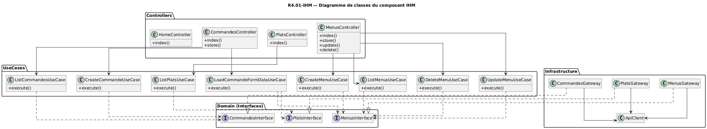

# R4.01 - Composant : IHM

Groupe : FABRE Alexis, GHEUX Théo, JACOB Alexandre, UYSUN Ali
Composant IHM développé par **GHEUX Théo**

Diagramme de classes simplifié du composant IHM (cliquer sur l'image pour l'agrandir) :

